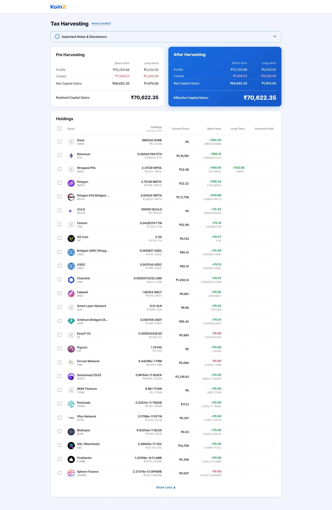
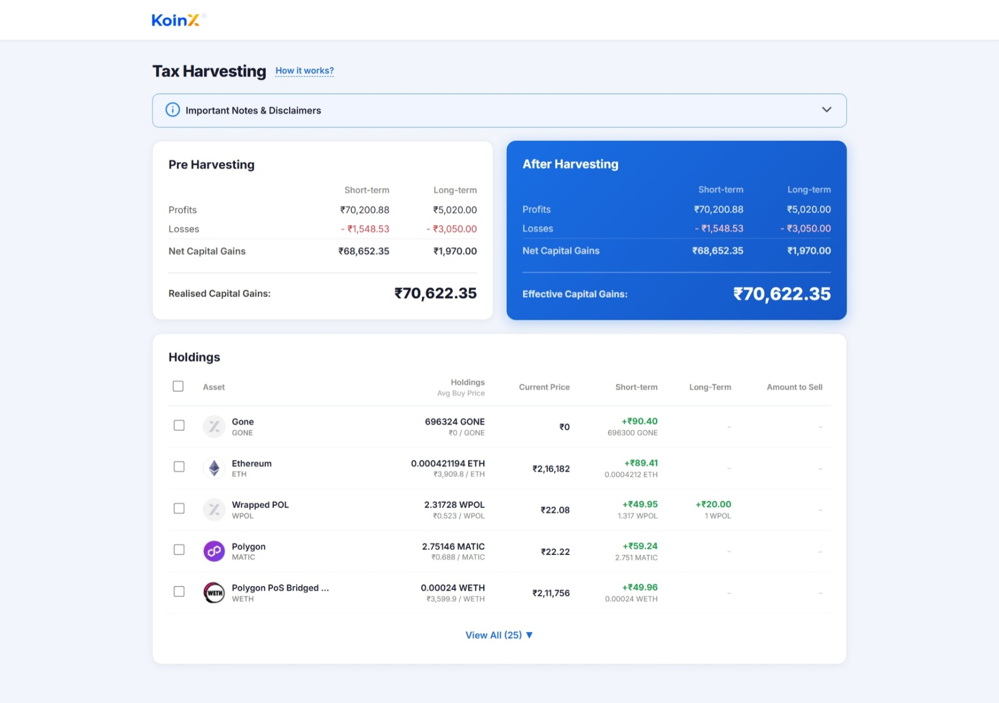
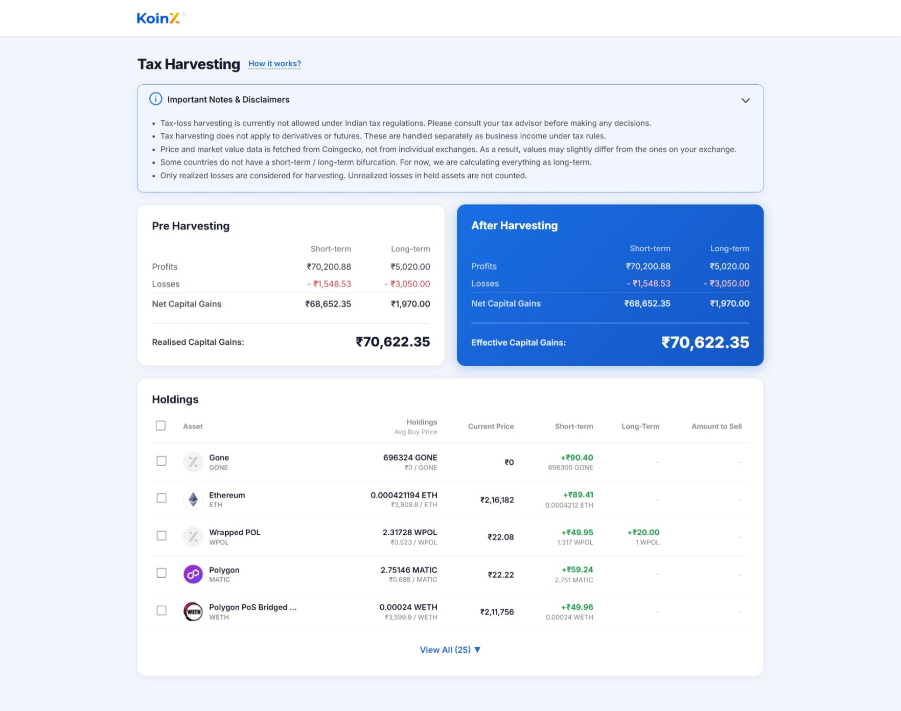

# KoinX — Tax Loss Harvester

A responsive React application for **Tax Loss Harvesting**, built as part of the KoinX Frontend Intern Assignment.

🔗 **Live Demo:** [tax-loss-harvester-black.vercel.app](https://tax-loss-harvester-black.vercel.app/)

---

## Getting Started

```bash
# Clone the repo
git clone <repo-url>
cd tax-loss-harvester/client

# Install dependencies
npm install

# Start development server
npm run dev
```

Open [http://localhost:5173](http://localhost:5173) in your browser.

---

## Features

- **Pre-Harvesting card** — Displays Short-term and Long-term capital gains (profits, losses, net) from the mock Capital Gains API.
- **After-Harvesting card** — Updates in real-time as you select/deselect holdings. Shows a savings message when post-harvest tax is lower.
- **Holdings table** — Full list of 25 holdings with:
  - Coin logo, name, symbol, avg buy price, current price, STCG/LTCG (colored green/red), amount to sell.
  - Per-row checkboxes + "Select All" header checkbox.
  - **View All** toggle — first 5 rows shown by default.
  - Selected rows highlighted with a blue left-border.
- **"How it works?"** tooltip — hover for a quick explainer with a "Know More" link.
- **Collapsible Important Notes & Disclaimers** accordion with info icon tooltip.
- **Skeleton loaders** for cards and table while data loads.
- **Error states** for failed API calls.
- **Mobile responsive** — cards stack vertically; table scrolls horizontally.

---

## Tech Stack

| | |
|---|---|
| **Framework** | React 19 + Vite |
| **Styling** | Vanilla CSS (no Tailwind / UI libraries) |
| **Icons** | lucide-react |
| **Data** | Mock APIs — Promise-based, no backend needed |
| **Hosting** | Vercel |

---

## Project Structure

```
client/
└── src/
    ├── api/
    │   ├── holdings.js          # Mock Holdings API (25 coins)
    │   └── capitalGains.js      # Mock Capital Gains API
    ├── components/
    │   ├── Header.jsx / .css
    │   ├── ImportantNotes.jsx / .css
    │   ├── PreHarvestingCard.jsx
    │   ├── AfterHarvestingCard.jsx
    │   ├── CapitalGainsCard.css  # Shared card styles
    │   └── HoldingsTable.jsx / .css
    ├── utils/
    │   └── formatters.js         # Currency & number formatting
    ├── App.jsx                   # Root component + business logic
    ├── App.css                   # Page layout & global styles
    └── index.css                 # CSS reset + font import
```

---

## Screenshots

.png)







---

## Business Logic

For each **selected** holding, after-harvesting gains are computed as:

- `stcg.gain > 0` → adds to STCG **profits**
- `stcg.gain < 0` → adds to STCG **losses**
- Same logic applies for `ltcg.gain`

**Net Gain (per term)** = profits − losses  
**Effective Capital Gains** = STCG net + LTCG net  
**Savings message** appears when effective gains after harvesting < pre-harvesting realised gains.

---

## Assumptions

- All currency values are in Indian Rupees (₹).
- Holdings are sorted by descending absolute gain (most impactful first).
- "Amount to Sell" shows the full `totalHolding` value when a row is selected.
